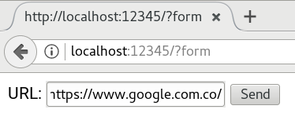
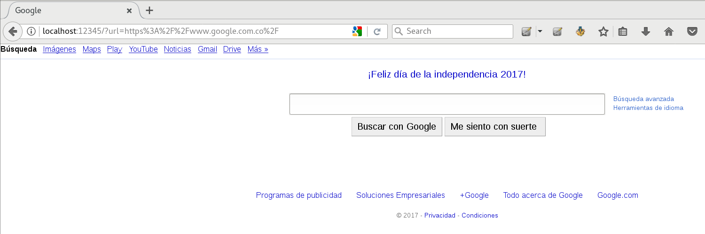
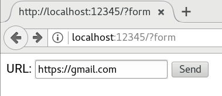

[](https://travis-ci.org/juusechec/goresource-proxy)
[](https://goreportcard.com/report/github.com/juusechec/goresource-proxy)

# goresource-proxy
A file proxy like https://github.com/Esri/resource-proxy Go Proxy Files

## parametros aceptados
- *url*: va la URL del recurso que se quiere obtener por el proxy
- *headers*: si se quiere escribir cabeceras sobre el proxy desde el backend,
estas van separadas por "\r\n" y el par clave valor con ":". Ver ejemplos.
- *renameheaders*: este puede tener cualquier valor (recomendado "true"),
al tener este parametro, renombra las cabeceras anteponiendo un *_* para que
puedan ser accedidas sin problemas desde un navegador.

## Algunos ejemplos:
Se realiza la petición a http://localhost:12345/?form
con la URL https://www.google.com.co/ que resulta en
http://localhost:12345/?url=https%3A%2F%2Fwww.google.com.co%2F
la cuál funciona correctamente.





Se realiza la petición a http://localhost:12345/?form
con la URL https://www.google.com.co/ que resulta en
http://localhost:12345/?url=https%3A%2F%2Fwww.google.com.co%2F
la cuál es rechazada debido a que no está en el archivo [whitelist.srt](./whitelist.srt)




Puede cambiar los HEADERS de la petición con el parámetro ***headers*** de la
petición GET, separando cada cabecera con el string "\r\n" (sin comillas) y
separando clave y valor con ":" (dos puntos), un ejemplo puede ser
"Cookie:newcookie\r\nGoogle:GENIO". La construcción en lenguaje Javascript sería.
URL sería.
```js
var headers = 'Cookie:newcookie\\r\\nGoogle:GENIO';
var url = 'https://www.google.com.co';
console.log(headers, url);
var completeURL = 'http://localhost:12345/proxy?headers=' + escape(headers) + '&url=' + escape(url);
console.log(completeURL);
```

Un flag como ***renameheaders*** es útil cuando se quieren leer cabeceras como
*Set-Cookie*  u otras, que por lo general son bloqueadas para las peticiones
ajax por cuestiones de seguridad, de esta manera que se puede acceder al valor
leyendo la nueva cabecera *_Set-Cookie*. Un ejemplo con *jQuery* ajax.

```js
var url = 'https://www.google.com.co/';
url = 'http://localhost:12345/proxy?url=' + escape(url) + '&renameheaders';

$.ajax({
  type: 'GET',
  url: url,
  beforeSend: function(xhr) {
    //xhr.setRequestHeader('Cookie', 'My Value'); // Write Header of Request
  },
  success: function(output, status, xhr) {
    console.log('success');
    // Read Header of Response
    console.log('My desired header: ', xhr.getResponseHeader('_Set-Cookie'));
    console.log('Get All response headers', xhr.getAllResponseHeaders());
  },
  error: function(err) { // Error callbak
    console.log('error', err);
  },
})
.always(function() { // Execute when finished
  console.log('complete');
});
```
